Git Study 06回 3.6~4.2
=========
## 3.6 リベース

ブランチの変更を別のブランチに統合するための方法が、Gitには二つあります  
- merge
- rebase
  
### リベースの基本

作業が二つに分岐しており、それぞれのブランチに対してコミットされている場合、  
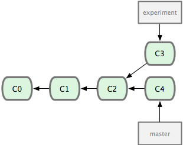

merge コマンドを使うと…  
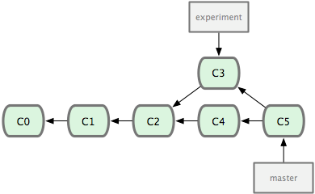

rebase コマンドを使うと…  
①ふたつのブランチの共通の先祖に移動  
②現在のブランチ上の各コミットのdiff を取得して一時ファイルに保存  
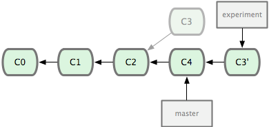

③現在のブランチの指す先をリベース先のブランチと同じコミットに移動させ  
④先ほどの変更を順に適用  
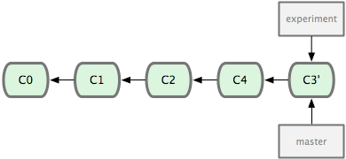
  
めっちゃすっきり！    
コマンドはこんな感じ  
```sh
$ git checkout experiment
$ git rebase master
```

    
最終的な結果は変わらないけど、そこまでの歴史がちがう。  
- merge … それぞれの最終地点を統合
- rebase … 一方のラインの作業内容をもう一方のラインに順に適用
    
### さらに興味深いリベース


たとえばこんなブランチがあったとき…。  
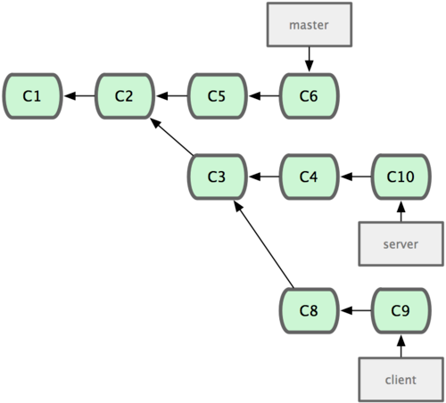

clientの変更をmargeしたい。  
かつ、serverブランチはそのまま置いときたい。  
そういう場合は、git rebaseの--ontoオプションを使う！  
```sh
$ git rebase --onto [newbase] [upstream] [branch]
```
例）
```sh
$ git rebase --onto master server client
```
（「client ブランチに移動して  
　　client ブランチとserver ブランチの共通の先祖からのパッチを取得し、  
　　master 上でそれを適用しろ」という意味です！）  
  
結果はこうなる！  
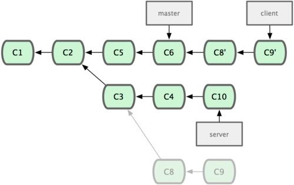
  
やっぱりシンプル！！  
  
直線的になったところでマージして…
```sh
$ git checkout master
$ git merge client
```
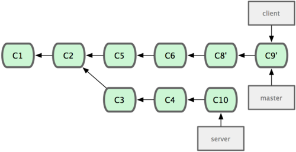
  
では、その後しばらく時間がたって、  
serverブランチも合流させたくなりました！ってときは､  
```sh
git rebase [basebranch] [topicbranch]
```
を使う！  
例)
```sh
$ git rebase master server
```
  
そのあとは、マージして不要なブランチを削除すれば…、  
```sh
$ git checkout master
$ git merge server
$ git branch -d client
$ git branch -d server
```

  
あの複雑だったブランチがなんと一本に！！  
  
 < やったね!!  

    
### ほんとうは怖いリベース
  
めっちゃ素敵なリベース！  
でも、リベースにも欠点があります！  
それは、、、  
  
** 公開リポジトリにプッシュしたコミットをリベースしてはいけない **  
※これ守らないと仁義ない感じになるよ！  
  
  
理由を例を挙げて説明していきます！  
サーバからクローンした環境で作業をしていたとします。  
（上：サーバ　下：ローカル）  
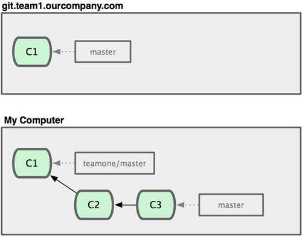
  
そこに、だれかがマージを含む作業をして、それをサーバーにプッシュしました。  
それを取得し、リモートブランチの内容を作業環境にマージしました。  
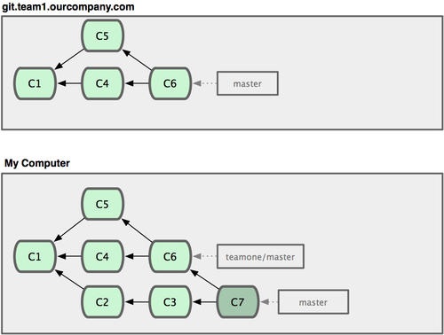
  
ほかの人('_\`)oO(なんかごちゃごちゃしてきたしリバースでもするか…。)  
('_\`) < git push --force (サーバ上の歴史を上書き)  
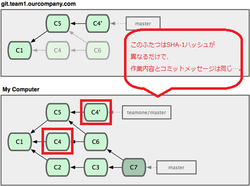
  
わたしoO(えっ…。すでにマージ済みなのに、またマージしなきゃ…。)ｲﾗｯ  
  
※リベースを行うとコミットのSHA-1 ハッシュが変わってしまうので、  
　Git はそれを新しいコミットと判断する。  
　⇒今後の他の開発者の作業を追いかけていくために、今回のコミットもマージする必要がある  
  
その結果、最終的にこうなる…。  
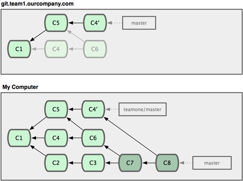  
git log で過去の作業尾内容みても、コミットメッセージ同じだし、  
コミットしてる人も一緒だし、日付も一緒だし、  
** 逆にわかりにくい！！ **  
  
つまり、  
リベース＝既存のコミットを破棄して新たなコミットを作成すること  
になってしまうので、  
リベースするのはまだ公開していないコミットのみに限定しましょう！  
    

# 第4章 Gitサーバ
  
では、サーバの話に移りましょう！！  
  
## 4.1 プロトコル
データ転送用のネットワークプロトコルとして、  
下記の4つがあります。  
  
- Local
- Secure Shell (SSH)
- Git
- HTTP
  
それぞれがどんなものなのかとどんな場面で使うべきか(使うべきでないか) を説明します。  
  
※HTTP 以外のすべてのプロトコルは、サーバー上にGit がインストールされている必要があります。  
  
  
### Local プロトコル
一番基本的なプロトコルです。  
(リモートリポジトリをディスク上の別のディレクトリに置くものです。)  
(チーム全員がアクセスできる共有ファイルシステム(NFS など) がある場合によく使われます。)  
  
共有ファイルシステムをマウントしているのなら、  
ローカルリポジトリにクローンするときはこういうコマンドを使います！  

```sh
$ git clone /opt/git/project.git
```
(単にパスを指定した場合は、Git はハードリンクを行うか、必要に応じて直接ファイルをコピーします。)
もしくは  
```sh
$ git clone file:///opt/git/project.git
```
(file:// を指定した場合は、Git がプロセスを立ち上げ、そのプロセスが(通常は) ネットワーク越しにデータを転送します。)  
  
通常のパス表記は高速！  
file://プレフィックスを使うと、関係のない参照やオブジェクトを除いたクリーンなコピーができる！  
  
ローカルのリポジトリを既存のGit プロジェクトに追加するには、このようなコマンドを実行する  
```sh
$ git remote add local_proj /opt/git/project.git
```
  
  
#### いい点
- シンプル
- 既存のファイルアクセス権やネットワークアクセスを流用できる
- ほかの誰かの作業ディレクトリの内容をすばやく取り込める
(同僚と作業しているプロジェクトで相手があなたに作業内容を確認してほしい言ってきたときなど、  
 わざわざリモートのサーバーにプッシュしてもらってそれをプルするよりは  
 単に git pull /home/john/project のようなコマンドを実行するほうがずっと簡単。)
  
  
#### 悪い点
- メンバーが別の場所にいるときに共有アクセスを設定するのは一般的に難しい
- 共有サーバ上に置いたリポジトリは、同じサーバーで稼動しているリポジトリにSSH でアクセスしたときよりも遅くなりがち  
  
  
### SSH プロトコル
Git の転送プロトコルのうちもっとも一般的  
  
クローンの方法  
```sh
$ git clone ssh://user@server:project.git
```
もしくは、  
```sh
$ git clone user@server:project.git
```
※プロトコルを明示しなくても、Git はそれがSSH であると見なします。  
※ユーザー名を省略すると現在ログインしているユーザーでの接続を行ってくれる。  
  
  
#### いい点
- ネットワーク越しでのリポジトリへの書き込みアクセスで認証が必要となる場面では、基本的にこのプロトコルを使わなければなりません
- 一般的にSSH 環境の準備は容易
- 多くのOS に標準で組み込まれており、管理用ツールが付属しているものもある
- SSH 越しのアクセスは安全(すべての転送データは暗号化され、信頼できるものとなる。)
- 転送するデータを可能な限りコンパクトにすることができる(効率的)
  
  
#### 悪い点
- リポジトリへの匿名アクセスを許可できない
⇒特定の企業のみで使うならこれしかない感じだけど、  
　オープンソースで使うのは微妙…。  
  
  
### Git プロトコル
Git に標準で付属する特別なデーモン  
専用のポートがあり、SSH プロトコルと同様のサービスを提供しますが、認証は行いません。  
Git プロトコルを提供するリポジトリを準備するには、git-export-daemon-ok というファイルを作らなければなりません。  
  
※すべての人が自由にクローンすることができる  
※許可しないとプッシュできない  
  
  
#### いい点
- もっとも高速な転送プロトコル
※SSHと同様のデータ転送メカニズムだが、暗号化と認証をしない分高速。  
※専用のポートがある。
  
  
#### 悪い点
- 認証の仕組みがない
書き込み権限を持つユーザにはSSHを使用させて、  
それ以外の人には読み込み専用としてgit://を使用するってパターンが多い。
- 準備するのがもっとも難しい
- ファイアウォールでポート9418 のアクセスを許可する必要がある

### HTTP/S プロトコル
HTTPプロトコルです！  
  
リポジトリへのHTTP での読み込みアクセスを許可するには、こんなふうにします。  
```sh
$ cd /var/www/htdocs/
$ git clone --bare /path/to/git_project gitproject.git
$ cd gitproject.git
$ mv hooks/post-update.sample hooks/post-update
$ chmod a+x hooks/post-update
```
Git に標準でついてくるpost-update フックは、  
適切なコマンド(git updateserver-info) を実行して  
HTTP でのフェッチとクローンをうまく動くようにする。  
※このコマンドが実行されるのは、このリポジトリに対してSSH 越しでのプッシュがあったときです。  
  
他の人たちがクローンする際には次のようにします。  

```sh
$ git clone http://example.com/gitproject.git
```
  
  
#### いい点
- 簡単にセットアップできる
- サーバー上のリソースを激しく使用することがない
- HTTPS で読み込み専用のリポジトリを公開することもできる
- 一般的なプロトコル(ファイアーウォールも安心！)
  
  
#### 悪い点
- リポジトリのフェッチやクローンには非常に時間がかかる
- ネットワークのオーバーヘッドや転送量が非常に増加する(必要なデータだけをやり取りする賢い機能はない)
  
  
  
今回はここまで！  
次回は4.2からお願いします！
